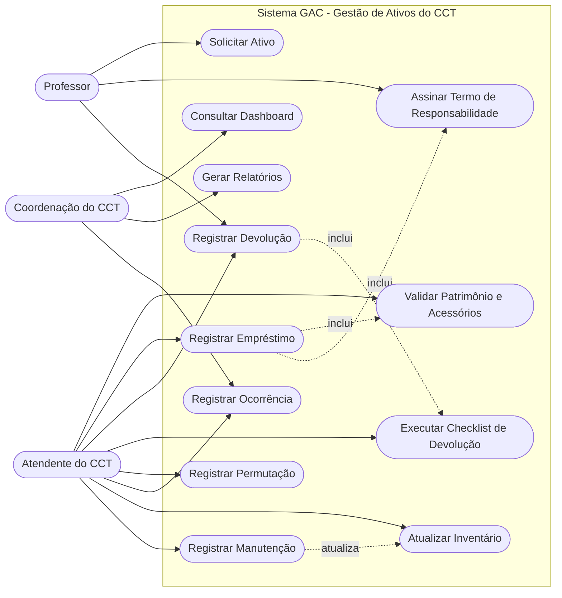
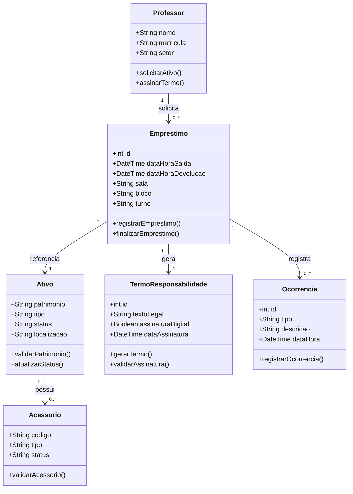
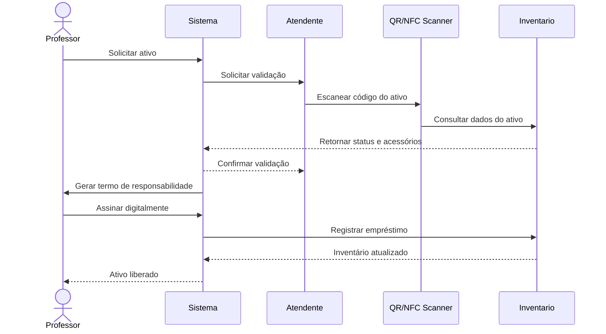
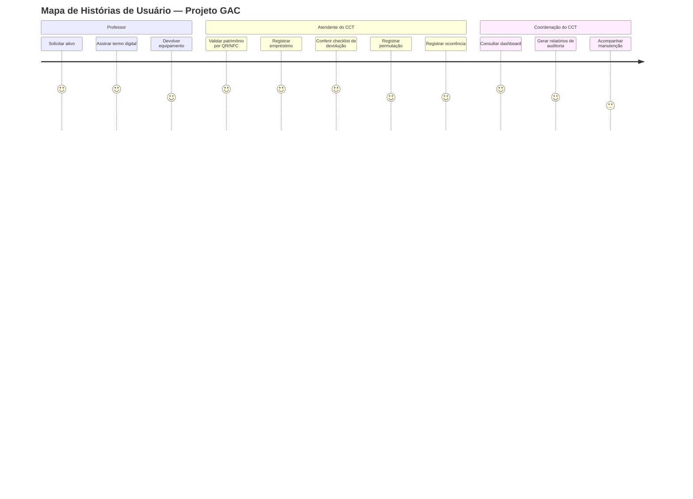

# Visão da Demanda (VD)

## Histórico de Versões

| Data       | Versão | Descrição                                                                                        | Autor         |
| ---------- | ------- | -------------------------------------------------------------------------------------------------- | ------------- |
| 11/05/2026 | 1.0     | Criação do documento de visão da demanda do Projeto GAC com base na elicitação, entrevistas, observação dos formulários e análise do controle atual de ativos do CCT. | Grupo Manitos |
|            |         |                                                                                                    |               |
|            |         |                                                                                                    |               |

## 1. Objetivo

Este documento apresenta a visão do Projeto GAC, Sistema de Gestão de Ativos do CCT, definindo o problema, a proposta de valor, o escopo inicial, os principais usuários, as funcionalidades de alto nível, as restrições e as diretrizes de arquitetura para apoiar o desenvolvimento da solução.

O objetivo do GAC é modernizar o controle de empréstimos e devoluções de equipamentos e chaves do Centro de Ciências Tecnológicas, substituindo formulários em papel e planilhas por uma solução digital, rastreável e mais segura.

## 2. Proposta de Valor

O GAC substitui o fluxo analógico por um ecossistema digital, ágil e rastreável. A solução reduz o preenchimento manual, centraliza o histórico dos empréstimos e permite saber quem está com cada ativo, em qual sala e em qual situação.

- **Agilidade:** retirada e devolução com menos digitação, menos filas e menor impacto no início das aulas.
- **Rastreabilidade:** vínculo entre professor, ativo, sala, data, horário e acessórios.
- **Segurança:** termo de responsabilidade digital e registro de aceite do responsável pelo empréstimo.
- **Governança:** histórico, relatórios e dashboard para apoiar auditoria e tomada de decisão.
- **Controle patrimonial:** identificação de projetores, cabos, adaptadores e chaves por código, QR Code ou NFC.

## 3. Descrição da Demanda

A demanda consiste no desenvolvimento de um sistema para controlar ativos utilizados em salas e atividades do CCT. O sistema deverá registrar inventário, empréstimos, devoluções, assinaturas de responsabilidade, checklist de acessórios, permuta de equipamentos, ocorrências, manutenção e relatórios gerenciais.

Atualmente, o controle ocorre por meio de formulários físicos e Google Planilhas. Esse processo gera retrabalho, dificulta atualizações simultâneas e reduz a visibilidade em tempo real sobre a localização dos ativos. A elicitação identificou cerca de 36 projetores, além de chaves originais e reservas, como parte do acervo controlado.

### 3.1. Elicitação utilizada

A elicitação foi realizada por meio de:

- análise documental dos termos de responsabilidade e formulários de devolução;
- observação do controle atual de chaves e equipamentos;
- entrevista semiestruturada com o auxiliar administrativo Kildery;
- análise dos registros em planilhas e dos fluxos de retirada e devolução.

### 3.2. Principais descobertas

- O preenchimento manual de dados como bloco, sala e turno consome tempo do atendente e do professor.
- A permutação informal de projetores entre salas dificulta a rastreabilidade.
- A numeração de acessórios, como cabos HDMI, precisa ser conferida para evitar trocas ou perdas.
- O controle de chaves originais e reservas exige rastreamento específico.
- O histórico de manutenção deve permitir retirar ativos com defeito da lista de itens disponíveis.

## 4. Partes Interessadas

| Nome | Papel | Responsabilidades | Representante |
| ---- | ----- | ----------------- | ------------- |
| Coordenação do CCT | Cliente / Gestor | Acompanhar a integridade patrimonial, consultar relatórios, validar necessidades administrativas e usar dados para tomada de decisão. | Coordenação do CCT |
| Atendentes do CCT | Usuário operacional | Registrar retirada, devolução, conferência de acessórios, permuta e ocorrências dos ativos. | Kildery e equipe operacional |
| Professores | Usuário final | Solicitar ou retirar equipamentos e chaves, assinar termo de responsabilidade e devolver os itens no prazo. | Corpo docente |
| Auxiliares administrativos | Stakeholder operacional | Apoiar o controle diário de equipamentos, chaves, planilhas e formulários. | Equipe administrativa do CCT |
| Professor Orientador | Stakeholder acadêmico | Avaliar e aprovar os artefatos produzidos pela equipe. | Prof. Marcelo Bezerra |
| Equipe de TI / Desenvolvimento | Desenvolvimento | Implementar, testar, manter e evoluir o sistema GAC. | Grupo Manitos |

## 5. Personas

### 5.1. Professor(a)

- **Descrição:** docente que precisa de projetor, cabo HDMI, adaptador ou chave para iniciar a aula.
- **Objetivo:** realizar a retirada rapidamente e devolver os itens sem burocracia.
- **Dor principal:** filas, repetição de dados, demora para liberar equipamento e dúvidas sobre responsabilidade por danos ou extravios.
- **Necessidade:** processo simples, rápido e com registro claro do que foi retirado.

### 5.2. Atendente do CCT

- **Descrição:** funcionário responsável por registrar retirada, devolução, conferência de acessórios e atualização do inventário.
- **Objetivo:** diminuir digitação, padronizar conferências e evitar retrabalho.
- **Dor principal:** formulários repetitivos, conferência manual de acessórios, planilhas desatualizadas e dificuldade de rastrear permutas.
- **Necessidade:** ferramenta que automatize registros e indique pendências de forma clara.

### 5.3. Coordenação do CCT

- **Descrição:** gestor responsável pelo controle patrimonial e pela operação do setor.
- **Objetivo:** acompanhar uso, localização, disponibilidade e ocorrências dos ativos.
- **Dor principal:** falta de relatórios confiáveis e dificuldade de auditoria em tempo real.
- **Necessidade:** dashboard, relatórios e histórico consolidado de uso e manutenção.

## 6 - necessidades e funcionalidades

### Necessidade 1: Inventário e identificação de ativos

#### F1.1 Cadastro de ativos

- **Descrição:** permite cadastrar projetores, cabos HDMI, adaptadores, fontes e chaves originais ou reservas.
- **Incluída**
- **Atores:** Atendente do CCT, Coordenação do CCT
- **Frequência:** Alta
- **Valor:** Alto

#### F1.2 Identificação por QR Code ou NFC

- **Descrição:** permite gerar e validar códigos de identificação para localizar rapidamente cada ativo.
- **Incluída**
- **Atores:** Atendente do CCT
- **Frequência:** Alta
- **Valor:** Alto

#### F1.3 Consulta de disponibilidade

- **Descrição:** permite consultar se o ativo está disponível, emprestado, em manutenção ou reservado.
- **Incluída**
- **Atores:** Atendente do CCT, Coordenação do CCT
- **Frequência:** Alta
- **Valor:** Alto

### Necessidade 2: Empréstimo e termo de responsabilidade

#### F2.1 Solicitação ou registro de empréstimo

- **Descrição:** permite registrar a saída de um ativo vinculado a professor, sala, bloco, turno, data e horário.
- **Incluída**
- **Atores:** Professor, Atendente do CCT
- **Frequência:** Alta
- **Valor:** Alto

#### F2.2 Assinatura digital do termo de responsabilidade

- **Descrição:** permite que o professor registre aceite digital assumindo responsabilidade pelo ativo, acessórios e possíveis danos ou extravios.
- **Incluída**
- **Atores:** Professor, Atendente do CCT
- **Frequência:** Alta
- **Valor:** Alto

#### F2.3 Liberação do ativo

- **Descrição:** libera o ativo somente após validação dos dados e aceite do termo de responsabilidade.
- **Incluída**
- **Atores:** Atendente do CCT
- **Frequência:** Alta
- **Valor:** Alto

### Necessidade 3: Devolução e checklist de acessórios

#### F3.1 Registro de devolução

- **Descrição:** permite registrar a devolução do ativo ao final do uso ou do turno letivo.
- **Incluída**
- **Atores:** Professor, Atendente do CCT
- **Frequência:** Alta
- **Valor:** Alto

#### F3.2 Checklist de devolução

- **Descrição:** exige conferência de cabo HDMI, fonte, adaptador, estado físico e identificação numérica dos acessórios.
- **Incluída**
- **Atores:** Atendente do CCT
- **Frequência:** Alta
- **Valor:** Alto

#### F3.3 Bloqueio de devolução incompleta

- **Descrição:** impede a conclusão da devolução quando acessórios obrigatórios estiverem ausentes, divergentes ou danificados.
- **Incluída**
- **Atores:** Atendente do CCT
- **Frequência:** Média
- **Valor:** Alto

### Necessidade 4: Permutação, ocorrências e manutenção

#### F4.1 Registro de permutação

- **Descrição:** permite registrar troca de equipamento entre salas ou entre professores, mantendo a rastreabilidade do ativo.
- **Incluída**
- **Atores:** Professor, Atendente do CCT
- **Frequência:** Média
- **Valor:** Alto

#### F4.2 Registro de ocorrência

- **Descrição:** permite registrar dano, falha, atraso, falta de acessório ou inconsistência de devolução.
- **Incluída**
- **Atores:** Atendente do CCT, Coordenação do CCT
- **Frequência:** Média
- **Valor:** Alto

#### F4.3 Módulo de manutenção

- **Descrição:** permite marcar ativos com defeito, retirar itens do inventário disponível e registrar retorno após reparo.
- **Incluída**
- **Atores:** Atendente do CCT, Coordenação do CCT
- **Frequência:** Média
- **Valor:** Médio

### Necessidade 5: Relatórios, auditoria e governança

#### F5.1 Dashboard de localização

- **Descrição:** permite visualizar em tempo real onde está cada ativo e quem é o responsável atual.
- **Incluída**
- **Atores:** Coordenação do CCT
- **Frequência:** Alta
- **Valor:** Alto

#### F5.2 Relatórios de auditoria e uso

- **Descrição:** permite exportar históricos de empréstimos, devoluções, ocorrências, atrasos e manutenções.
- **Incluída**
- **Atores:** Coordenação do CCT
- **Frequência:** Média
- **Valor:** Alto

#### F5.3 Histórico de alterações

- **Descrição:** mantém registro das alterações realizadas nos dados de ativos, empréstimos e devoluções.
- **Incluída**
- **Atores:** Atendente do CCT, Coordenação do CCT
- **Frequência:** Sempre
- **Valor:** Alto

### Necessidade 6: Requisitos de segurança e operação

#### F6.1 Autenticação de usuários

- **Descrição:** garante que apenas usuários autorizados acessem funcionalidades administrativas.
- **Incluída**
- **Atores:** Atendente do CCT, Coordenação do CCT, Equipe de TI
- **Frequência:** Sempre
- **Valor:** Alto

#### F6.2 Controle de perfis

- **Descrição:** diferencia permissões de professor, atendente, coordenação e equipe técnica.
- **Incluída**
- **Atores:** Todos
- **Frequência:** Sempre
- **Valor:** Alto

#### F6.3 Tempo de resposta das consultas

- **Descrição:** as consultas principais de ativo, professor e empréstimo devem responder rapidamente para não gerar filas no atendimento.
- **Incluída**
- **Atores:** Todos
- **Frequência:** Sempre
- **Valor:** Alto

## 7. Arquitetura da Demanda

O sistema será composto por módulos de inventário, empréstimo, devolução, assinatura digital, checklist de acessórios, gestão de chaves, ocorrências, manutenção, relatórios e autenticação. A solução deverá ser acessível por navegador web e/ou interface mobile, com banco de dados centralizado para manter os registros atualizados em tempo real.

### 7.1. Módulos previstos

- **Inventário de ativos:** cadastro e consulta de projetores, cabos, adaptadores, fontes e chaves.
- **Identificação digital:** leitura por QR Code ou NFC para validação rápida do patrimônio.
- **Empréstimo:** registro de saída do ativo vinculado ao professor e à sala.
- **Termo de responsabilidade:** aceite digital com data, hora e responsável.
- **Devolução:** baixa do ativo e conferência por checklist.
- **Permutação:** transferência formal de responsabilidade em caso de troca de sala ou equipamento.
- **Manutenção:** registro de defeitos e indisponibilidade temporária.
- **Relatórios e dashboard:** acompanhamento de uso, localização, pendências e auditoria.

### 7.2. Diagrama de Caso de Uso

### 7.3. Diagrama de Classes Inicial

### 7.4. Diagrama de Sequência Inicial

### 7.5. Mapa de Histórias de Usuário

---

## Checklist de Validação do Documento de Visão

- [x] O objetivo está claro e alinhado ao problema/necessidade?
- [x] A proposta de valor é mensurável e relevante?
- [x] Todas as partes interessadas estão listadas com papéis definidos?
- [x] Existem pelo menos duas personas descritas?
- [x] Todas as necessidades e funcionalidades estão relacionadas a atores?
- [x] Há indicação de valor e frequência para cada funcionalidade?
- [x] A arquitetura está ilustrada (mesmo que de forma simples)?
- [x] O documento está escrito em linguagem clara e objetiva?

---
